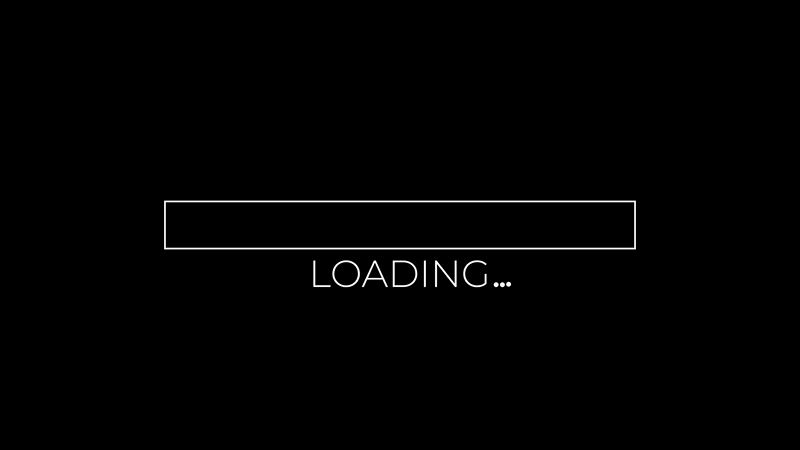

<h1 align="center"> How is it going ?</h1>

# 🚀 Skills/Goals

### Learning • Building • Working Hard 

 

<table align="center">

<tr>

<td align="center" width="250">

## 🤖
### AI

Artificial Intelligence,  
Machine Learning, automation  
and intelligent systems.

</td>

<td align="center" width="250">

## ❄️
### Industrial Refrigeration

Industrial refrigeration experience,  
cooling systems, controls  
and technology.

</td>

<td align="center" width="250">

## ⚙️
### Engineering

Problem solving, technical  
knowledge and engineering  
projects. Investigation and searching

</td>

<td align="center" width="250">

## 💻
### Programming

Building software,  
learning new technologies  
and creating solutions.

</td>

<td align="center" width="250">

## 🚀
### Projects

Turning my ideas into my own
real projects.

</td>

</table>

 

### 🧠 Keep Learning • 💪 Work Hard • 🚀 Build • 🤖 Innovate

  
